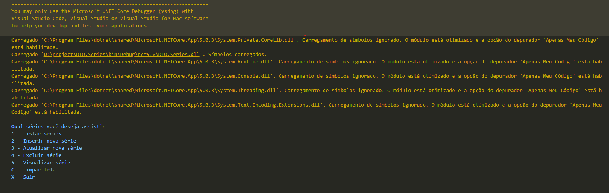

<h1 align="center">App simples de cadastro de séries com .NET</h1>

Criado um algoritmo simples de cadastro de séries para praticar meus conhecimentos de orientação a objetos, o principal paradigma de programação utilizada no mercado. Nesse projeto foi colocado para pensar orientação a objetos, como modelar o seu domínio, como utilizar recursos de coleção.

<h3 align="center">Clone e inicie o projeto :</h3>

                                            $ dotnet run program.cs 

<h3 align="center">Design</h3>

> Versão netcor

<h3>Ferramentas usadas</h3>

* Visual Studio ;
* Visual Studio Code;
* Bash (criado via terminal project init);